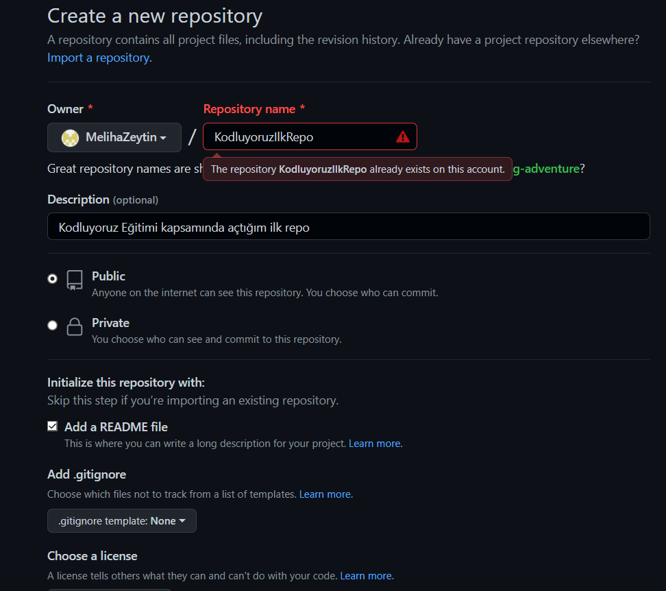

# **Kodluyoruz İlk Repo**

www.patika.dev

Bu repo [Kodluyoruz](https://www.kodluyoruz.org/) Front-End Eğitiminde oluşturduğumuz ilk repo, içerisinde bir adet README dosyasıi bir adet de index.html barındırıyor.

## **Installation**

Öncelikle projeyi clonelayın. (Buraya sizin reponuzdan aldığınız link gelecek)

> git clone https://github.com/MelihaZeytin/kodluyoruzilkrepo.git

## **Usage**

Projeyi cloneladıktan sonra Visual Studio Code programını açınız.

Linux için:

> cd kodluyoruzilkrepo  
code .

## **Contributing**

Pull requestler kabul edilir. Büyük değişiklikler için, lütfen önce neyi değiştirmek istediğinizi tartışmak için bir konu açınız.

## **Licence** 

[MIT](https://choosealicense.com/licenses/mit/)
